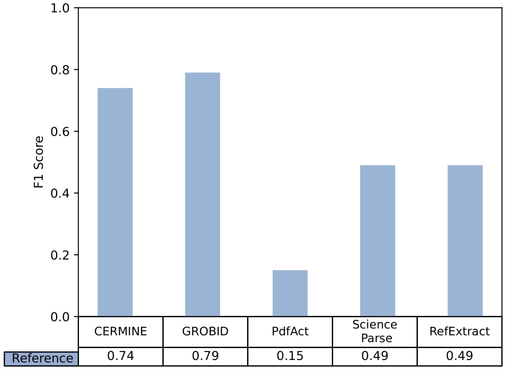
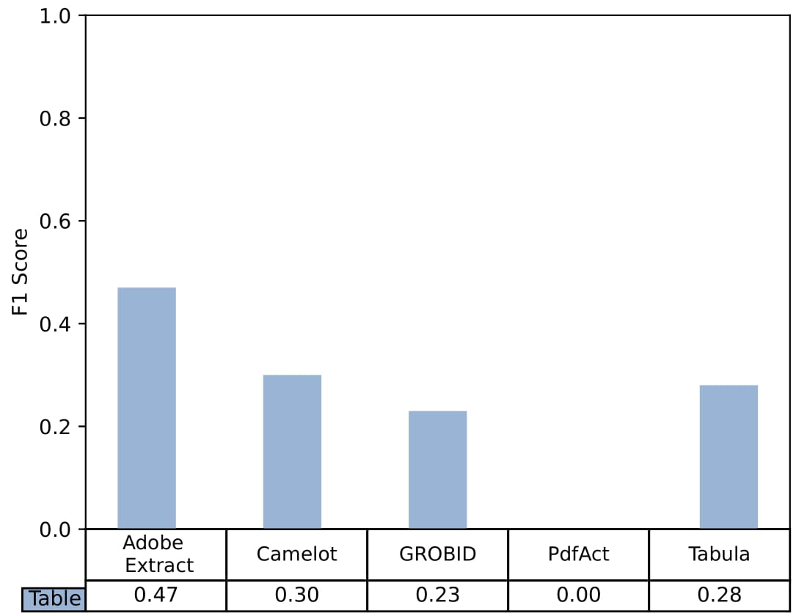
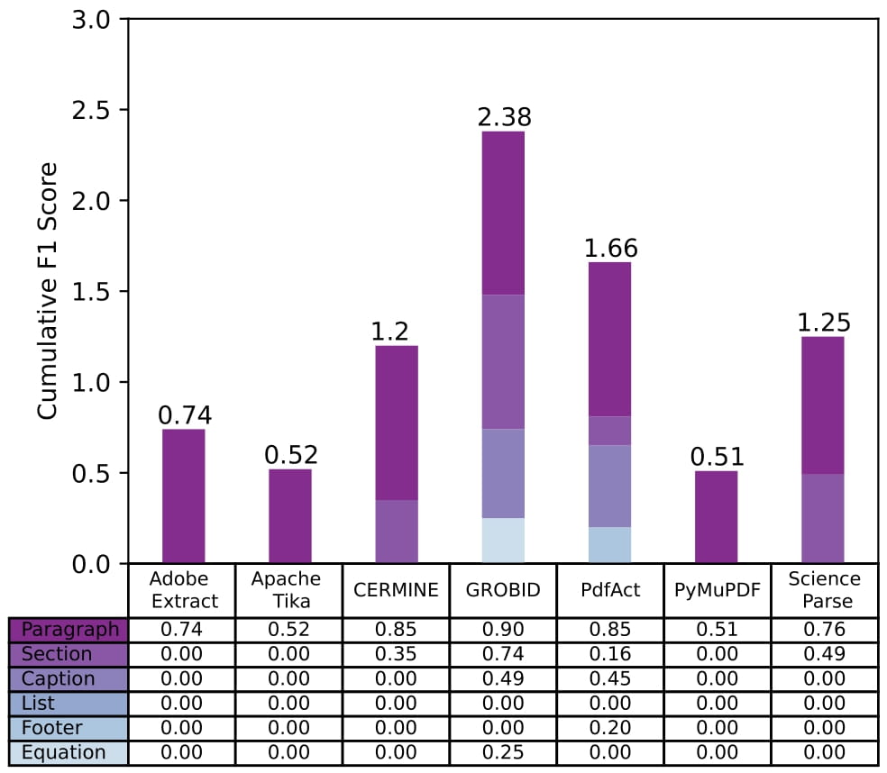
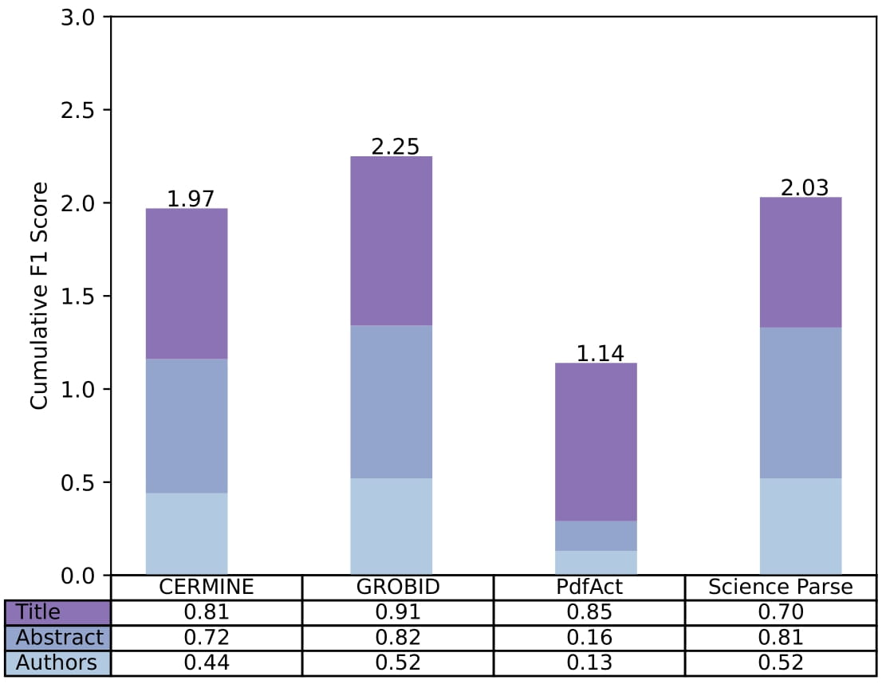
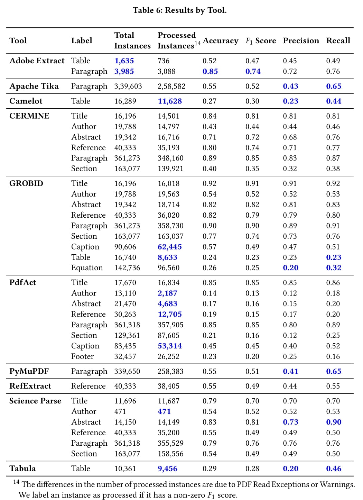

# A Benchmark of PDF Information Extraction Tools using a Multi-Task and Multi-Domain Evaluation Framework

<!---
## Related Work


-->

## Overview of Evaluated Tools
| Tool          | Version | Task(s)<sup>1</sup>   | Technology                   | Output         |
|---------------|---------|------------|------------------------------|----------------|
| Adobe Extract | 1.0     | T, G       | Adobe Sensei AI Framework    | JSON, XLSX     |
| Apache Tika   | 2.0.0   | G          | Apache PDFBox                | TXT            |
| Camelot       | 0.10.1  | T          | PDFMiner, OpenCV             | CSV, Dataframe |
| CERMINE       | 1.13    | M, R, G    | SVM, CRF, Rule-based, iText  | NLM JATS       |
| GROBID        | 0.7.0   | M, R, T, G | CRF, Deep Learning, Pdfalto  | TEI XML        |
| PdfAct        | n/a     | M, R, T, G | Rule-based, pdftotext        | TXT, XML, JSON |
| PyMuPDF       | 1.19.1  | G          | OCR, tesseract               | TXT            |
| RefExtract    | 0.2.5   | R          | Rule-based, pdftotext        | TXT            |
| ScienceParse  | 1.0     | M, R, G    | CRF, Rule-based, pdffigures2 | JSON           |
| Tabula        | 1.2.1   | T          | Rule-based, PDFBox           | Dataframe, CSV |

<sup>1</sup> **M**etadata, **R**eferences, **T**able, **G**eneral

## Evaluation Framework
<p float="left" align="center">

</p>

## Evaluation Metrics

### Token-level Levenshtein ratio  and Similarity Matrix 

<p float="left" align="center">


</p>

<p float="left" align="center">

 
 </p>
 
<p float="left" align="center">


</p>

## Results
<p float="left" align="center">
          
          
</p>
<p float="left" align="center">


</p>

<p float="left" align="center">

</p>

# Workflow Template
To use the evalution pipeline proposed below methods can be reused.
Basic template file is placed [here](https://github.com/Media-Bias-Group/PDF-Information-Extraction-Benchmark/blob/main/usability_template.py). 
## PDF Class
```
class PDF:
    def __init__(self, page_number=None, pdf_name=None, filepath=None, txt_name=None, txt_data=None):
        self.page_number = page_number
        self.pdf_name = pdf_name
        self.filepath=filepath
        self.txt_name=txt_name
        self.txt_data=txt_data
```
## Utility Functions
```
def crop_pdf(pdfpath,pdfname, pagenumber):
    #pages = [pagenumber] # page 1, 3, 5
    try:
        pdf_file_name = pdfname
        file_base_name = pdf_file_name.replace('.pdf', '')
        pdf = PdfFileReader(pdfpath + os.sep + pdf_file_name, strict=False)
        pdfWriter = PdfFileWriter()
        #for page_num in pages:
        pdfWriter.addPage(pdf.getPage(int(pagenumber)))
        cropped_file=pdfpath + os.sep + file_base_name + '_subset_' + pagenumber + '.pdf'
        with open(cropped_file, 'wb') as f:
            pdfWriter.write(f)
            f.close()
        return cropped_file
    except Exception:
        pass
        
def locate_data(dir):
    """
    Function to find Text their respective PDF files from DocBank dataset.
    :param dir: Base directory
    :return: list of text and pdf files.
    """
    pdffiles=glob(path.join(dir,"*.{}".format('pdf')))
    txtfiles=glob(path.join(dir,"*.{}".format('txt')))
    return pdffiles, txtfiles
 ```

## Creating PDF Objects
This block of code is used to create the PDF Objects. 
### Type I (Without cropped page)
```
def load_data(dir):
    """
    Function creates the PDF objects for the gives base directory of DocBank dataset.
    :param dir: Base location of DocBank dataset.
    :return: List of PDF Objects.
    """
    pdff,txtf = locate_data(dir)
    PDFlist=[]

    for txt in txtf:
        nwe=os.path.splitext(os.path.basename(txt))[0] # 2.tar_1801.00617.gz_idempotents_arxiv_4.txt --> 2.tar_1801.00617.gz_idempotents_arxiv_4
        keyword=nwe.rpartition('_')[0] # 2.tar_1801.00617.gz_idempotents_arxiv_4 --> 2.tar_1801.00617.gz_idempotents_arxiv
        page_number=nwe.split('_')[-1]  # 2.tar_1801.00617.gz_idempotents_arxiv_4 --> 4
        pdfn = dir + "/" +keyword + "_black.pdf"
        if os.path.isfile(pdfn):
            pdf_name=os.path.basename(pdfn)
            txt_name=os.path.basename(txt)
            txtdf=pd.read_csv(txt,sep='\t',quoting=csv.QUOTE_NONE,encoding='latin1',usecols=[0,1,2,3,4,9], names=["token", "x0", "y0", "x1", "y1","label"])
            PDFlist.append(PDF(page_number,pdf_name,dir,txt_name,txtdf))
    return PDFlist
```
### Type II (With cropped page)
```
def load_data_subset(dir):
    """
    Function creates the PDF objects for the gives base directory of DocBank dataset.
    :param dir: Base location of DocBank dataset.
    :return: List of PDF Objects.
    """
    pdff,txtf = locate_data(dir)
    PDFlist=[]

    for txt in txtf:
        nwe=os.path.splitext(os.path.basename(txt))[0] # 2.tar_1801.00617.gz_idempotents_arxiv_4.txt --> 2.tar_1801.00617.gz_idempotents_arxiv_4
        keyword=nwe.rpartition('_')[0] # 2.tar_1801.00617.gz_idempotents_arxiv_4 --> 2.tar_1801.00617.gz_idempotents_arxiv
        page_number=nwe.split('_')[-1]  # 2.tar_1801.00617.gz_idempotents_arxiv_4 --> 4
        pdfn = dir + "/" +keyword + "_black_subset_" + str(page_number) +".pdf"
        if os.path.isfile(pdfn):
            pdf_name=os.path.basename(pdfn)
            txt_name=os.path.basename(txt)
            txtdf=pd.read_csv(txt,sep='\t',quoting=csv.QUOTE_NONE,encoding='latin1',usecols=[0,9], names=["token","label"])
            PDFlist.append(PDF(page_number,pdf_name,dir,txt_name,txtdf))
    return PDFlist
 ```

## Sorting the files as per component under evaluation
To only use the files which contains respective component under evaluation. 
```
def sort_files(dir, label):
    PDFlist = load_data(dir)
    p = Path(dir + "/sort_pdfs/")
    p.mkdir(parents=True, exist_ok=True)
    for PDF in PDFlist:
        ## Here can go either of below 2 methods
       get_gt_wcrop(PDF,  p, True, label)
    return str(p)
```

### TYPE I (with cropping the PDF file)
```
def get_gt_crop(PDFObj, p, label, retflag):
    txt_data = PDFObj.txt_data
    gt_frame_labled = txt_data.loc[(txt_data['label'] == label)]
    if len(gt_frame_labled) != 0:
        if retflag == True:
            croppedfile = crop_pdf(PDFObj.filepath, PDFObj.pdf_name, PDFObj.page_number)
            if isinstance(croppedfile, type(None)):
                return
            #realfile= str(p) + os.sep + PDFObj.pdf_name
            txtname = PDFObj.filepath + os.sep + PDFObj.txt_name
            copy(croppedfile, p)
            #os.replace(croppedfile, realfile)
            copy(txtname, p)
            return
        else:
            return gt_frame_labled
```

### TYPE II (without cropping the PDF file)
```
def get_gt_wcrop(PDFObj, p, retflag, label):
    """
    Function has two purpose controlled by retflag parameter.
    1. retflag==True : find the GT files in DocBank containing metadata labels and copy them into seperate directory in tree called "metadata_pdfs"
    2. retflag==False: return the reference dataframes
    :param PDF: PDF Object
    :param retflag: flag to control the role of the function.
    :return: Ground truth reference dataframe.
    """
    txt_data = PDFObj.txt_data
    ref_frame_labled = txt_data.loc[(txt_data['label'] == label)]
    if len(ref_frame_labled) != 0:
        if retflag == True:
            filename = PDFObj.filepath + os.sep + PDFObj.pdf_name
            txtname = PDFObj.filepath + os.sep + PDFObj.txt_name
            copy(filename, p)
            copy(txtname, p)
            return
        else:
            return ref_frame_labled
```

## Create Ground-truth DataFrame for a component
```
def create_gt_df(dir, label):
    # Load data based on cropped or non-cropped
    PDFlist=load_data(dir)
    IDs=[]
    values=[]
    pageno=[]
    for pdf in PDFlist:
        # Create GT DF based on cropped or non-cropped
        gt_df=get_gt_wcrop(pdf, '',label, False)
        if isinstance(gt_df, type(None)):
            continue
        data_str = gt_df['token'].astype(str).str.cat(sep=' ')
        values.append(data_str)
        id=os.path.splitext(pdf.pdf_name)[0]
        IDs.append(id)
        pageno.append(pdf.page_number)
    gt= label + '_gt'
    data_gt_df=pd.DataFrame({'ID':IDs, gt:values, 'page':pageno})
    return data_gt_df
```

## Computing similarity matrix
```
def compute_sim_matrix(ex_nump, gt_nump):
    """
    This function computes the similarity matrix for each word from a numpy array. or it can also compare whole abstract as a collated tokens.
    :param ex_nump: Extracted paragraph as numpy array
    :param gt_nump: Ground truth paragraph as numpy array
    :return: Similarity Matrix with Lavensteins similarity index.
    """
    matrix = cdist(ex_nump.reshape(-1, 1), gt_nump.reshape(-1, 1), lambda x, y: ratio(x[0], y[0]))
    df = pd.DataFrame(data=matrix, index=ex_nump, columns=gt_nump)
    return df
```
## Compute evaluation metrics
```
def compute_tpfp(matrix):
    """
    This function considers Extracted token as Ground-truth token when its Levenshteins similarity index is > 0.7. Otherwise it is non-gt token.
    :param matrix: Similarity Matrix
    :return: Number of GT in ET, Number of Non GT
    """
    tp=0
    fp=0
    rows=matrix.shape[0]
    cols=matrix.shape[1]
    for x in range(0,rows):
        for y in range(0,cols):
            if matrix.iloc[x,y] > 0.7:
                flag=True
                break
            else:
                flag=False
        if flag is True:
            tp=tp+1
        else:
            fp=fp+1
    return tp,fp

def compute_scores(tp,fp, gttoken):
    """
    Function to compute the evaluation metrics.
    :param tp: Number of GT in ET
    :param fp: Number of Non-GT in ET
    :param gttoken: Number of GT
    :return: Precision, Recall and F1 Score
    """
    prec=tp/(tp+fp)
    recall= tp/gttoken
    if prec==0 and recall==0:
        return 0,0,0
    else:
        f1_score= (2 * prec * recall)/ (prec + recall)
        return f1_score, prec, recall
```
## Assemble Data (Separated Tokens, Collated Tokens)
```
def compute_results(dataf, field):
    """
    Function computes the similarity index and string distance for extracted and ground truth tokens.
    :param dataf: dataframe with one row of extracted and ground truth
    :param field: Token for which similarity is computed. e.g. Title, Abstract, Author.
    :return: Dataframe with computed similarity indices, no. of extracted tokens, no. of ground truth tokens.
    """
    extracted=field + '_ex'
    groundtruth=field + '_gt'
    df_extracted=dataf[[extracted]]
    df_groundtruth=dataf[[groundtruth]]
    df_extracted = df_extracted.astype(str).applymap(str.split).apply(pd.Series.explode,axis=0).reset_index().drop("index", 1)
    df_groundtruth = df_groundtruth.astype(str).applymap(str.split).apply(pd.Series.explode, axis=0).reset_index().drop("index", 1)
    df_extracted=df_extracted.applymap(str)

    # Computing similarity matrix for collated tokens (Accuracy)
    df_extractednp = dataf[extracted].to_numpy()
    df_groundtruthnp = dataf[groundtruth].to_numpy()
    matrix = compute_sim_matrix(df_extractednp, df_groundtruthnp)

    no_of_gt_tokens = len(df_groundtruth.index)
    df_e = df_extracted.to_numpy()
    df_g = df_groundtruth.to_numpy()
    # Computing similarity matrix for separated tokens
    simmatrix = compute_sim_matrix(df_e, df_g)

    # Compute evaluation metrics (Precision, Recall, F1 Score)
    tp,fp=compute_tpfp(simmatrix)
    f1,prec,recal=compute_scores(tp,fp,no_of_gt_tokens)

    return f1,prec,recal, matrix.iloc[0,0]
```

## Tool specific implementation

### label Extraction
```
def extraction_function(paradir):
    # Here goes the implementation for the component extract
    return 0
```
### label parsing 
```
def parse_extracted_component(paradir):
    # After extracted of the components they are parsed into DataFrame
    # ID field must be PDF filename
    # For example for title parsing DF columns would be (columns=['ID', 'title_ex'])
    EX_DF= "Extracted DF"
    return EX_DF
```

## Flow of execution
```
def main():
    # Create PDF Object for the files with that particular component
    paradir = sort_files("/home/apurv/Thesis/PDF-Information-Extraction-Benchmark/Data/Docbank_sample", 'reference')

    ## Tool specific implementation
    extraction_function(paradir)
    resultdf = parse_extracted_component(paradir)

    ## Columns of the GT DF is columns=['ID', 'title_gt'] where ID is filename
    gtdf=create_gt_df(paradir, 'title')

    ## Merge the GT and EX DataFrames
    final_df = pd.merge(resultdf.astype(str), gtdf.astype(str), on='ID')

    resultdata=[]
    for i in tqdm(range(len(final_df))):
        df=final_df.iloc[i, 1:3].to_frame().transpose()
        f1, pre, recall, lavsim = compute_results(df, 'reference')
        #resultdata.append(['TOOL', final_df.iloc[i, 0].rpartition("_subset")[0] + ".pdf", final_df.iloc[i, 3], 'reference', pre, recall, f1, lavsim])
        resultdata.append(
            ['TOOL', final_df.iloc[i, 0] + ".pdf", final_df.iloc[i, 3], 'reference', pre,
             recall, f1, lavsim])

    resultdf = pd.DataFrame(resultdata, columns=['Tool', 'ID', 'Page', 'Label', 'Precision','Recall' ,'F1', 'SpatialDist'])
    filename = 'tool_extract_label.csv'
    outputf = '/home/apurv/Thesis/PDF-Information-Extraction-Benchmark/Results/' + filename
    resultdf.to_csv(outputf, index=False)
    #shutil.rmtree(paradir)

if __name__ == "__main__":
    main()
```


